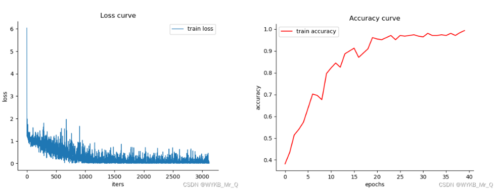

## 第一部分 实验概述

### 单线循迹

#### 目标

使小车沿着白线行进，并保证小车中心时刻与白线对齐。

#### 思路

1. 获取摄像头中的白色像素点，并取平均值，得到的结果就是白线的中央位置；
2. 根据摄像头中心与白线的中央的偏差来设计小车的不同行为。

#### 实现

##### 获取白线中央

- 利用OpenCV中的cv2.cvtColor函数将小车摄像头的画面从RGB空间转为HSV空间。

    ```python
    HSV_frame = cv2.cvtColor(frame, cv2.COLOR_BGR2HSV)
    ```

- 选取视野中的某一片区域，扫描其中的所有白色像素点。

通过查阅白色的HSV值，并考虑反光的影响，我们用下面的函数来判别某个像素点是否为白色。

```python
def is_white(point):
    if point[1] < 20  and point[2] > 230:
        return 1
    else:
        return 0
```

这里主要判别的依据使像素点的S值和V值。

- 取该区域内所有白色像素点的的x坐标的平均值，即为白线的中央位置。

    ```python
    def getmid(hsv):
        midline = []
        for y in range(80, 100):
            white_x = [81]
            for x in range(20,140):
                if is_white(hsv[y][x]):
                    white_x.append(x)
                    hsv[y][x] = (0, 0, 0)

            if len(white_x) == 0:
                pass
            else:
                midline.append(sum(white_x)/len(white_x))

            hsv[y][int(midline[-1])] = (0, 0, 0)
        
        return sum(midline)/len(midline) 
    ```

这里我们进行将扫描到的白色像素点都赋值成黑色，以便我们在摄像头中更清楚地观察检测是否有误。

##### 根据偏差设计行为

- 当摄像头中心与白线中央产生了偏差`dmid`，我们就要给小车设置适当的前进速度`x_speed`和角速度`w`，让小车重新回到白线的中央位置。

    ```python
    car.set_speed(x_speed, y_speed, w)
    ```

### 双线循迹

#### 目标

使小车能在黄线和白线中间行进。

#### 思路

1. 获取摄像头中的白色和黄色像素点，并取平均值，得到的结果就是双线的中央位置；
2. 根据摄像头中心与双线的中央的偏差来设计小车的不同行为。

#### 实现

##### 获取双线中央

- 选取视野中的某一片区域，扫描其中的所有白色和黄色像素点。

通过查阅黄色的HSV值，并考虑反光的影响，我们用下面的函数来判别某个像素点是否为黄色。

```python
def is_yellow(point):
    if point[0] > 26 and point[0] < 34 and point[1] >43 and point[2] > 46:
        return 1
    else:
        return 0
```

这里主要判别的依据使像素点的H值和S值。

- 计算该区域内所有白色像素点x坐标的平均值和黄色像素点的的x坐标的平均值，再对二者取平均，即为双线的中央位置。

    ```python
    def getmid(hsv):
        midline = [81]
        white_is_left = 1
        for y in range(80, 100):
            white_x = []
            yellow_x = []
            for x in range(0,160):
                if is_white(hsv[y][x]):
                    if x < 81:
                        white_x.append(x)
                        hsv[y][x] = (0, 0, 0)
                if is_yellow(hsv[y][x]):
                    yellow_x.append(x)
                    hsv[y][x] = (0 ,0 ,0)
            if(len(white_x) == 0 or len(yellow_x) == 0):
                pass
            else:
                midline.append((white_x[-1] + yellow_x[-1])/2)
            hsv[y][int(midline[-1])] = (0, 0, 0)

        return sum(midline)/len(midline)  
    ```

这里我们进行将扫描到的白色像素点都赋值成黑色，以便我们在摄像头中更清楚地观察检测是否有误。

##### 根据偏差设计行为

与单线巡迹类似，这里不再赘述。

### 标志牌识别

#### 目标

在单线循迹基础上，使小车能够识别标志牌，并根据其指示转弯、停止。

#### 思路

1. 搭建一个2层卷积的神经网络`CNN`，根据`left`，`right`，`park`，`straight`四个类别下的数据集进行训练，得到权重(.pth)；
2. 通过识别蓝色区域，检测小车摄像头读入的画面中是否存在指示牌；
3. 根据训练好的模型，识别指示牌的种类，并据此设计小车的不同行为。

#### 实现

##### 神经网络的搭建

- 设备配置及超参数定义。

    ```python
    device = torch.device('cuda' if torch.cuda.is_available() else 'cpu')

    num_epochs = 8
    batch_size = 100
    lr = 0.001
    ```

- 数据预处理

    ```python
    transform = transforms.Compose([
    transforms.Resize((28, 28)),                 # 调整图像大小为28x28
    transforms.Grayscale(num_output_channels=1), # 转换为灰度图像
    transforms.ToTensor(),                       # 转换为张量
    transforms.Normalize(mean=[0.5], std=[0.5])  # 单通道归一化
    ])
    ```

这里按要求将照片裁剪成28*28。

- 定义 CNN 模型。

    ```python
    class CNN(nn.Module):
    def __init__(self, num_classes):
        super(CNN, self).__init__()
        # 定义卷积层部分
        self.conv = nn.Sequential(
            nn.Conv2d(1, 16, 3, padding=1),  # 卷积层1：输入1个通道，输出16个通道，卷积核大小为3x3，边界填充保持尺寸不变
            nn.Conv2d(16, 16, 5),            # 卷积层2：输入16个通道，输出16个通道，卷积核大小为5x5
            nn.ReLU(),                       # 激活函数：为卷积层添加非线性能力
            nn.MaxPool2d(2, stride=2),       # 池化层1：将特征图尺寸缩小一半，窗口大小为2x2
            nn.Dropout(0.3),                 # Dropout层1：以30%的概率随机丢弃神经元，防止过拟合
            nn.Conv2d(16, 32, 5),            # 卷积层3：输入16个通道，输出32个通道，卷积核大小为5x5
            nn.ReLU(),                       # 激活函数：为卷积层添加非线性能力
            nn.MaxPool2d(2, stride=2),       # 池化层2：将特征图尺寸缩小一半，窗口大小为2x2
            nn.Dropout(0.3)                  # Dropout层2：以30%的概率随机丢弃神经元，防止过拟合
        )

        # 定义全连接层部分
        self.fc = nn.Sequential(
            nn.Linear(32 * 4 * 4, 100),  # 全连接层1：输入为展平的特征图 (32通道 x 4x4)，输出100个神经元
            nn.ReLU(),                   # 激活函数：添加非线性能力
            nn.Linear(100, num_classes)  # 全连接层2：将输出映射到类别数，num_classes为分类任务的类别总数
        )

        # 初始化权重
        self.initialize_weights()

    def initialize_weights(self):
        # 遍历所有层，初始化卷积层和全连接层的权重
        for m in self.modules():
            if isinstance(m, nn.Conv2d) or isinstance(m, nn.Linear):
                nn.init.kaiming_uniform_(m.weight, a=math.sqrt(5))  # 使用Kaiming均匀初始化方法
                if m.bias is not None:  # 初始化偏置为0
                    nn.init.constant_(m.bias, 0)

    def forward(self, x):
        x = self.conv(x)                # 前向传播：通过卷积层提取特征
        x = x.view(-1, 32 * 4 * 4)      # 展平操作：将多维特征图展平为一维向量
        x = self.fc(x)                  # 前向传播：通过全连接层进行分类
        return x                        # 返回模型的最终输出
    ```

- 定义训练函数。

    ```python
    def train_model(model, train_loader, criterion, optimizer, num_epochs, device):
        model.train() # 打开梯度
        for epoch in range(num_epochs):
            running_loss = 0.0
            correct = 0
            total = 0
            for images, labels in train_loader:
                images = images.to(device) # 输入和模型在同一设备中
                labels = labels.to(device)

                optimizer.zero_grad()
                outputs = model(images)
                loss = criterion(outputs, labels)
                loss.backward() # 反向传播
                optimizer.step()

                running_loss += loss.item()
                _, predicted = torch.max(outputs.data, 1)
                total += labels.size(0)
                correct += (predicted == labels).sum().item()

            epoch_loss = running_loss / len(train_loader)
            epoch_acc = 100 * correct / total
            print(f'Epoch {epoch + 1}/{num_epochs}, Loss: {epoch_loss:.4f}, Accuracy: {epoch_acc:.2f}%')

        torch.save(model.state_dict(), 'traffic_sign_model.pth')
    ```

- 定义测试函数。

    ```python
    def test_model(model, test_loader, device):
        model.eval()
        correct = 0
        total = 0
        with torch.no_grad(): # 关闭梯度
            for images, labels in test_loader: 
                images = images.to(device)
                labels = labels.to(device)
                outputs = model(images)
                _, predicted = torch.max(outputs.data, 1)
                total += labels.size(0)
                correct += (predicted == labels).sum().item()

        accuracy = 100 * correct / total
        print(f'Test Accuracy: {accuracy:.2f}%')
    ```

- 加载数据集并进行训练、测试。

    ```python
    def main():
        print(f'Using {device} for training')

        # 加载数据
        train_dataset = ImageFolder('data/train', transform=transform)
        train_loader = DataLoader(train_dataset, batch_size=batch_size, shuffle=True, num_workers=2) # batch_size:批量处理

        test_dataset = ImageFolder('data/test', transform=transform)
        test_loader = DataLoader(test_dataset, batch_size=batch_size, shuffle=False, num_workers=2)

        # 确定类别数量
        num_classes = len(train_dataset.classes)
        model = CNN(num_classes).to(device)

        # 定义损失函数和优化器
        criterion = nn.CrossEntropyLoss()
        optimizer = optim.Adam(model.parameters(), lr=lr)

        # 训练模型
        train_model(model, train_loader, criterion, optimizer, num_epochs, device)
        # 测试模型
        test_model(model, test_loader, device)
    ```

##### 神经网络的推理

- 找到视野中所有大于特定大小的蓝色的部分，说明小车离指示牌已经足够近。

    ```python
    lower_blue = np.array([100, 150, 50])
    upper_blue = np.array([140, 255, 255])
    
    mask = cv2.inRange(hsv, lower_blue, upper_blue)
    masked_frame = cv2.bitwise_and(frame, frame, mask=mask)

    contours, _ = cv2.findContours(mask, cv2.RETR_EXTERNAL, cv2.CHAIN_APPROX_SIMPLE)
    ```

这里利用OpenCV创建蓝色掩码，并据此寻找蓝色轮廓。

- 从所有的蓝色轮廓中筛选出最大的那一个，防止其他指示牌的干扰。

    ```python
    max_cnt = 0
    max_size = 0
    x, y, w1, h = 0, 0, 0, 0
    
    for cnt in contours:
        x, y, w1, h = cv2.boundingRect(cnt)
        if w1 * h > max_size:
            max_cnt = cnt
            max_size = w1 * h 
    
    if max_cnt != 0: 
        x, y, w1, h = cv2.boundingRect(max_cnt)
    ```

- 将该蓝色区域带入训练好的模型中，加载权重，得到识别结果。

    ```python
    with torch.no_grad():
            outputs = model(sign_img.double())
            probabilities = torch.softmax(outputs, dim=1)
            _, predicted = torch.max(probabilities, 1)
            predicted_class = class_labels[predicted.item()]
            confidence = probabilities[0][predicted.item()].item()
  
    cv2.putText(frame, f"{predicted_class}: {confidence:.2f}", (x, y - 10),
                cv2.FONT_HERSHEY_SIMPLEX, 0.6, (0, 255, 0), 2)
    ```

##### 根据识别结果设计行为

- 识别结果为`straight`，按单线巡迹逻辑前进；

    ```python   
    if predicted_class == 'straight':
        car.set_speed(x_speed, y_speed, w)
    ```

- 识别结果为`left`，左转1s；

    ```python
    elif predicted_class == 'left':
        car.set_speed(0, 0, 40)
        time.sleep(1)
    ```

- 识别结果为`right`，右转1s；

    ```python
    elif predicted_class == 'right':
        car.set_speed(0, 0, -40)
        time.sleep(1)
    ```

- 识别结果为`park`，立即停车并退出循环，程序终止；

    ```python
    elif predicted_class == 'park':
        car.set_speed(0, 0, 0)
        break
    ```

- 未识别到指示牌，按单线巡迹逻辑前进。

    ```python
    else:
        car.set_speed(x_speed, y_speed, w)
    ```

## 第二部分 重难点分析与解决方案

### 单线与双线巡迹

#### 问题一  

倘若过弯和直线行驶的速度设定为同一个值，效率较低。

解决方法：
这里我们设计了一个优化算法，即小车的`x_speed`和`w`并非一沉不变，而是与偏差`dmid`有着某种映射关系。
- 当偏差较大时，`x_speed`应该相应减小，留出足够时间调整；
  
    ```python
    if (abs(dmid) >= 18):
        x_speed /= 5
    ```

- 当偏差较小时，可以根据偏差的具体数值适当增大`x_speed`，这里我们采用了线性映射。
  
    ```python       
    if (abs(dmid) <= 5):
        x_speed *= -0.125*abs(2*dmid) + 2.25
    ```

#### 问题二

直线行驶时，偶尔会出现车身左右摇晃的现象，并且一旦出现很难自我消除。

解决方法：
这里我们引入了丐版PID算法，即`w`的值由这一次和上一次的偏差共同决定，使小车在调整姿态过程中更加平稳。
        
```python
kp = 2
kd = 1
        
last_dmid = dmid
dmid = 81 - mid
d = dmid - last_mid
            
w = kp * dmid + kd * d
```

#### 问题三

双线道路位于地图边缘，易受到地面反光的影响，原有的代码可能会将反光误认为白色色块。

解决方法：这里我们在原有代码中加入判断，忽略黄线外侧的所有白色。

### 标志牌识别

#### 问题四

模型对于训练集识别正确率可达99%以上，但对测试集识别正确率只能达到84%左右，出现“过拟合”现象。

解决方法：
1. 将超参数中的迭代次数`num_epochs`由20轮降低为8轮；

    ```python
    num_epochs = 8
    ```

2. 原先只对四种指示牌各读入100张照片，后改为读入所有照片，每种指示牌约500-600张。

    ```python
    train_dataset = ImageFolder('data/train',transform=transform)
    test_dataset = ImageFolder('data/test', transform=transform)
    ```

#### 问题五

训练结果不够清晰。

解决方法：利用matplotlib可视化`Loss`和`Accuracy`随`epochs`变化曲线。




#### 问题六

模型在电脑本地测试集上正确率很高，但是在树莓派上的效果出现异常的差，甚至完全识别不出来，出现置信率为`NaN`(Not a Number)的情况。

解决方法：
树莓派上的系统是32位的，默认的数据精度是`float单精度浮点数`，而在本地的训练环境是64位的系统，默认的数据精度都是`double双精度浮点数`，因此直接在树莓派上进行推理会存在数据精度的差异，导致推理效果不一致。

可以通过`.double()`方法将网络精度和网络的输入都设置成`double`类型。

```python
model.double()
```

```python
outputs = model(sign_img.double())
```
## 第三部分 本实验的收获

在智能车感知实践的视觉感知部分中，我学会了图像处理和深度学习的一些最基本的方法，比如通过OpenCV处理图像，如转化为HSV颜色空间以及对图像二值化等；比如搭建一个简单的两层卷积的神经网络，并根据数据集训练模型。 

在小车的构建过程中，我和我的队友渡过了无数反复调试与优化的过程。当我们设计出一种与众不同的巡线算法，使得小车更稳更快时，我们都非常有成就感。当我们搭建的神经网络能顺利跑起来，我们也充满对这一块未知领域的好奇心。 

这门课程不仅让我初步了解了图像处理与深度学习的相关知识，也培养了我的团队合作和DEBUG的能力。感谢老师和助教们的悉心指导，这段实践经历让我更加坚定了在自动化领域深入学习的决心！