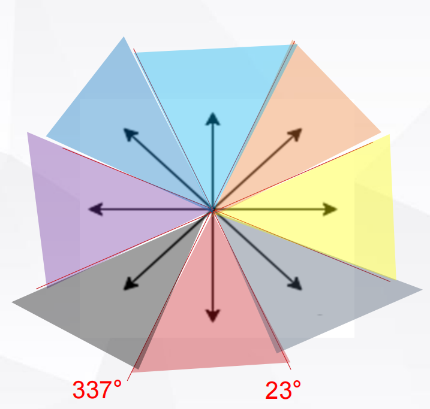
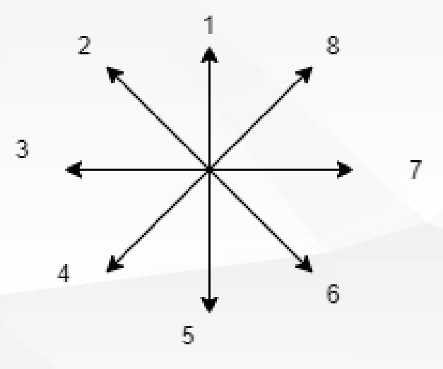

## 实验目的及应用背景

### 实验目的

本实验旨在利用激光雷达与麦克纳姆小车的结合，通过Arduino编程实现以下目标：

1. 实现基于激光雷达的原地避障功能，使小车能够被动躲避障碍物；
2. 利用麦克纳姆小车的多方向运动能力，结合激光雷达数据进行路径规划与控制；
3. 通过多个场景（原地避障、环形赛道、迷宫赛道）的实验，验证激光雷达避障算法的可靠性与实时性。

### 应用背景

激光雷达因其高精度的环境感知能力，被广泛应用于无人驾驶、智能机器人等领域。本实验的应用背景包括：
1. **无人驾驶技术**：激光雷达用于障碍物检测、环境建图和路径规划。
2. **动态避障需求**：相比摄像头，激光雷达在低光照或复杂环境中表现更稳定，适合实时避障。
3. **智能机器人发展**：仓储物流、自动导航等场景需要高精度避障和路径规划功能，包括酒店送货机器人和智能扫地机器人等等。

## 实验主要器材

### 麦克纳姆小车

麦克纳姆小车因其独特的轮子设计，具备全方位移动能力。通过控制四个轮子的旋转速度和方向，小车可实现前后、左右及斜向等多种运动方式，特别适合狭窄空间中的灵活运动控制。

### 激光雷达

实验中使用的是 **Rplidar A1** 激光雷达，具有以下特点：
- 二维平面探测范围达 12 米；
- 360 度全方位测距，生成点云地图；
- 采用三角测距系统，成本低且精度高；
- 能适应室内和弱光环境，适合复杂环境中的障碍物检测。

### ESP32控制板

ESP32 是一款高性能的微控制器，用于处理激光雷达采集的数据并控制麦克纳姆小车的运动。其内置 WiFi 和蓝牙功能，便于无线调试和数据传输。

## 实验内容

### 原地避障

#### 任务目标

当激光雷达检测到靠近的障碍物时，小车能够沿相反方向运动。

#### 思路

1. 使用激光雷达进行 360 度扫描，生成点云数据。
1. 分析激光雷达检测到的障碍物方位和距离。
3. 根据障碍物位置，控制麦克纳姆小车向相反方向移动。
   
#### 实现

##### 获取最近障碍物相对于小车的角度以及距离

- 设置`distance_min`和`angle_min`分别用于存储最近障碍物距离和对应角；
    ```cpp
    float distance_min = 10; // 用于存储最近障碍物距离
    int angle_min = 0;      // 用于存储最近障碍物对应角度
    ```

- 遍历distances数组，找到`distance_min`和`angle_min`相应的值。
    ```cpp
    for (int angle = 0; angle < 360; angle++) {
        float distance = distances[angle];
        if (distance >= 0.15) {           
            if (distance < distance_min) {  
                distance_min = distance;      
                angle_min = angle;            
            }
        }
    }
    ```

##### 控制小车向相反的方向移动

- 将激光雷达的探测区域按照角度分为8份；
  

- 根据`angle_min`落在不同的区域，控制小车向相反的方向运动。
    ```cpp
    if (angle_min > 22.5 + 45 * 7 || angle_min < 22.5 + 45 * 0)  
        mecanum.driveAllMotor(100, 100, 100, 100);               
    if (angle_min > 22.5 + 45 * 3 || angle_min < 22.5 + 45 * 4)  
        mecanum.driveAllMotor(-100, -100, -100, -100);          
    if (angle_min > 22.5 + 45 * 0 || angle_min < 22.5 + 45 * 1)  
        mecanum.driveAllMotor(100, 0, 0, 100);                 
    if (angle_min > 22.5 + 45 * 6 || angle_min < 22.5 + 45 * 7)  
        mecanum.driveAllMotor(0, 100, 100, 0);        
    if (angle_min > 22.5 + 45 * 1 || angle_min < 22.5 + 45 * 2) 
        mecanum.driveAllMotor(100, -100, -100, 100);            
    if (angle_min > 22.5 + 45 * 5 || angle_min < 22.5 + 45 * 6)  
        mecanum.driveAllMotor(-100, 100, 100, -100);            
    if (angle_min > 22.5 + 45 * 2 || angle_min < 22.5 + 45 * 3)  
        mecanum.driveAllMotor(0, -100, -100, 00);            
    if (angle_min > 22.5 + 45 * 4 || angle_min < 22.5 + 45 * 5) 
        mecanum.driveAllMotor(-100, 0, 0, -100);             
    ```
### 环形赛道

#### 任务目标

在环形赛道中，小车需要基于激光雷达的数据保持在水管中间向前移动。

#### 实现

##### setspeed(x_speed, y_speed, w)

- 因为转弯比较频繁，故这里进行`driveALLMotor`到`setspeed`函数的转换；
    ```cpp
    void setspeed(float x, float y, float w)
    {
    float fl,fr,bl,br;
    fl = x + y - w;
    fr = x - y + w;
    bl = x - y - w;
    br = x + y + w;
    mecanum.driveAllMotor(fl, fr, bl, br);
    }
    ```

##### 获取中线

- 记105°\~135°为小车左侧，125°\~255°为右侧，计算两侧距离障碍物的距离之差，再取平均；
    ```cpp
    float midline(float data[])
    {
    float res = 0;
    for(int i = 225; i < 255; i++)
        res += (data[i] - data[360 - i]);
    return res / 30.00;
    }
    ```

##### PID算法

- 同巡线小车一样，我们这里引入丐版PID算法，即`w`的值由这一次和上一次的偏差共同决定，使小车在调整姿态过程中更加平稳。
    ```cpp
    last_mid = mid;
    mid = midline(distances);
    float dmid = last_mid - mid;
    w = (-k * mid - p * dmid) / 1000.00;
    ```

### 迷宫赛道

#### 任务目标

在迷宫环境中，小车需要利用激光雷达扫描各个方向距墙壁的距离，遵循**始终靠右走**的原则，最终走出迷宫。

#### 实现

##### 获取各个方向距墙壁的距离

- 前方
    ```cpp
    float getfront(float data[])
    {
        float res = 0;
        int num = 0;
        for(int i = 170; i < 190; i++)
        {
            if(data[i] != 0)
            {
            res += data[i];
            num ++;
            }
        }
        return res / (num + 0.01); // 防止nan的错误
    }
    ```

- 右后

    ```cpp
    float getrightback(float data[])
    {
        float res = 0;
        int num = 0;
        for(int i =275; i < 315; i++)
        {
            if(data[i] != 0)
            {
            res += data[i];
            num ++;
            }
        }
        return res / (num + 0.01); // 防止nan的错误
    }
    ```

- 右前

    ```cpp
    float getrightfront(float data[])
    {
        float res = 0;
        int num = 0;
        for(int i = 225; i < 265; i++)
        {
            if(data[i] != 0)
            {
            res += data[i];
            num ++;
            }
        }
        return res / (num + 0.01); // 防止nan的错误
    }
    ```

##### 主体逻辑

- 前方距离不够，则转弯；优先左转，该行为优先级高；
    ```cpp
    if (getfront(distances) < threshold)
    {
        x_speed = -35;  
        w = w > 0 ? 30.00 * w : w / 8.00;
    }    
    ```

- 偏离中心线，则修正；
    ```cpp
    else if (mid < 250.00)
    {
        y_speed = -55.00;
    }
    ```

- 右前距离偏过大，即转弯的时候右墙消失，适当减小转弯速度；
    ```cpp
    else if (difference > 800.00)
    {
        w /= 8.00;
    }
    ```

- 前方距离充足，则加速。
    ```cpp
    if (getfront(distances) >= 800.00)
    {
        x_speed += 60;
    }
    ```

## 实验结果及分析

### 原地避障

- 小车能够正确识别最近障碍物所在的角度范围，并且能够向相反的方向避障。

### 环形赛道

- 受限于雷达的精度以及distances数组的更新速率，小车行为出现滞后性，同时并不是严格巡着中线前进，而是轨迹偏左。
  
- 但是，当我们将速度设定得较低的时候，小车能够很好地完成绕圈前进地任务，并且碰撞次数较少。

### 迷宫赛道

- 小车始终贴着右墙走，能够较好地进行转弯与掉头，完成多个来回的迷宫。
  
- 小车偶尔会在转弯的地方摇摆不定，以及在掉头的地方逻辑判断错误。
  
- 小车距前方距离很近时才会转弯，偶尔会撞到前方的墙。

## 实验中遇到的问题及其解决方法

### 原地避障

1. ESP32驱动安装失败

解决方法：连接手机热点后重试，解决。

2. 若采用如下图所示的8个方向，上、下、左、右、左前、左后、右前、右后处在交界处，难以判断
   


解决方法：更换为前文所述的8个方向。

### 环形赛道

3.  不理解`if (startBit)`的作用，将其删去，导致distances数组未更新完毕，小车就会根据里面的值采取相应的行动

解决方法：将所有逻辑放在`if (startBit)`代码块中。

4. 弯道行驶时，偶尔会出现车身左右摇晃的现象，并且一旦出现很难自我消除

解决方法：引入丐版PID算法，即`w`的值由这一次和上一次的偏差共同决定，使小车在调整姿态过程中更加平稳。

```cpp
last_mid = mid;
mid = midline(distances);
float dmid = last_mid - mid;
w = (-k * mid - p * dmid) / 1000.00;
```

### 迷宫赛道

5. 激光雷达探测存在死区，即无法检测 0.15 米以内的障碍物，并且从判断到执行逻辑有延迟

解决方法：在算法中加入安全距离判断，提前避障。
```cpp
if (getfront(distances) < threshold)
{
    x_speed = -35;  
    w = w > 0 ? 30.00 * w : w / 8.00;
}    
```

6. 小车在转弯的时候会出现刚右转完，立即又满足左转条件的情况，于是一直在左转和右转之间摇摆不定
   
解决方法：转弯的时候，设置右转角速度远大于左转，即右转的优先级较高，同时设置一定数值的`x_speeed`，有助于摆脱困境。
```cpp
if (getfront(distances) < threshold)
{
    x_speed = -35;  
    w = w > 0 ? 30.00 * w : w / 8.00;
}    
```

7. 如果小车距离墙非常近，某些函数的返回值出现nan错误

解决方法：考虑到`num`可能为0，会出现除以0的错误，将`num`加上一个小量，既不影响结果，又不会出现错误。
```cpp
float getfront(float data[])
{
    float res = 0;
    int num = 0;
    for(int i = 170; i < 190; i++)
    {
        if(data[i] != 0)
        {
        res += data[i];
        num ++;
        }
    }
    return res / (num + 0.01); // 防止nan的错误
}
```

8. 小车即使摆在道路正中央，左边和右边的差距依然不是0，或者接近0

解决方法：发现distances数组中，某些角度对应的distance值没有正确更新，而是0。因此，在读取distances数组时，先判断distance是否为0，在进行计算以及`num`的自增。
```cpp
if(data[i] != 0)
{
    res += data[i];
    num ++;
}
```

